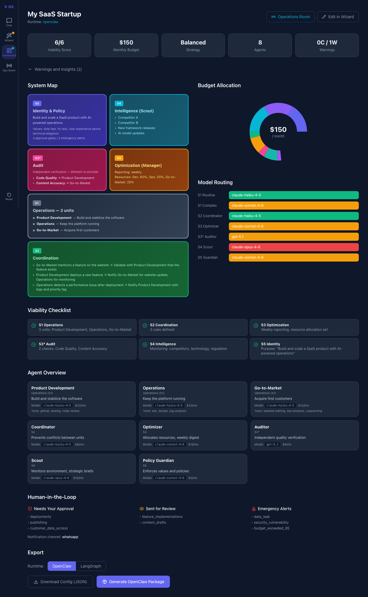
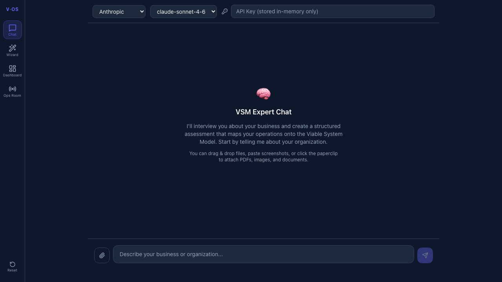
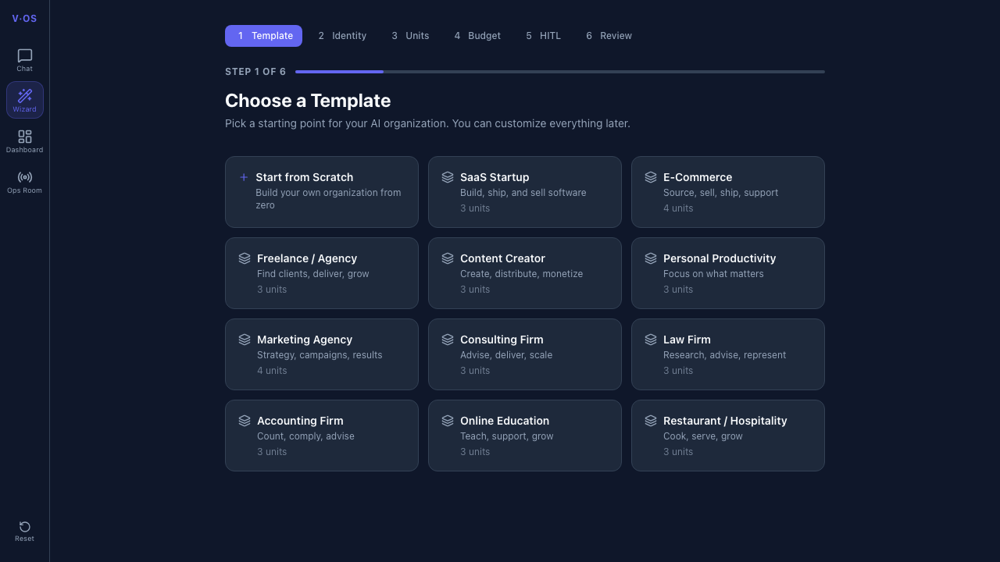
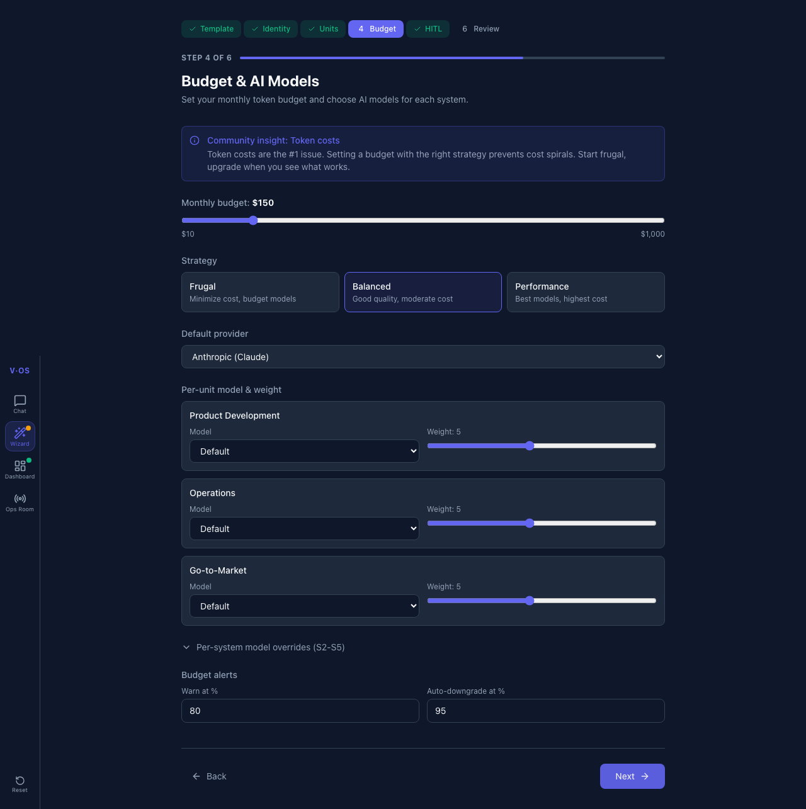
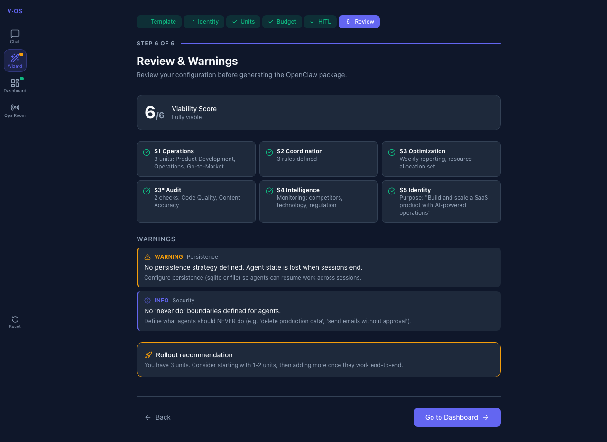
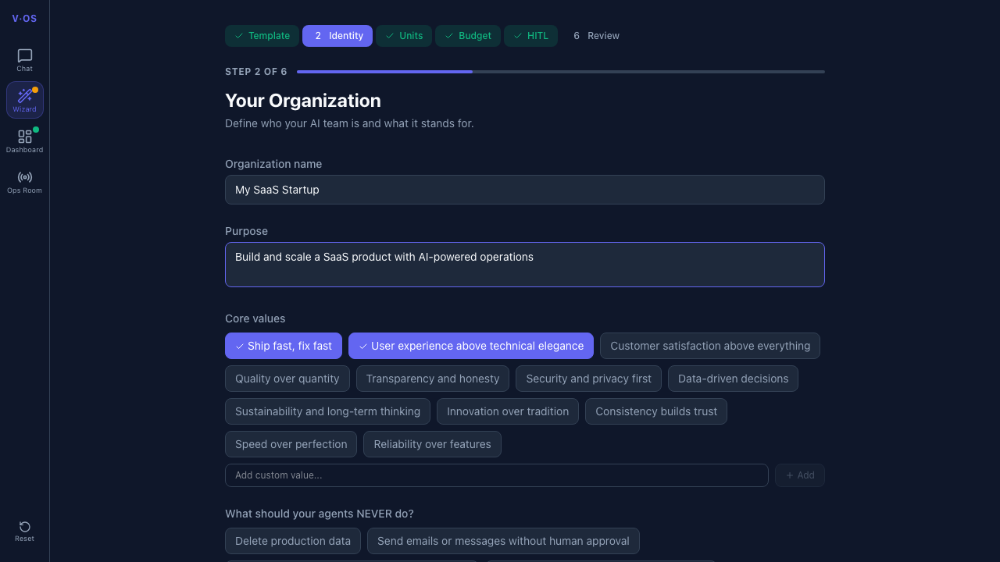
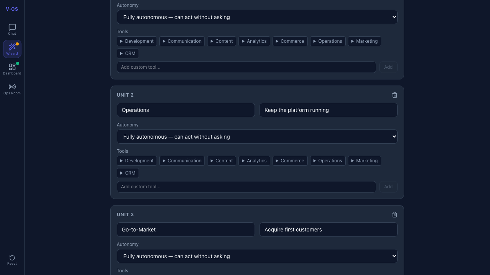

# ViableOS

**The operating system for viable AI agent organizations.**

ViableOS applies the [Viable System Model](https://en.wikipedia.org/wiki/Viable_system_model) (VSM) to multi-agent AI systems. Instead of building a flat list of agents, you design a self-governing organization with operations, coordination, optimization, audit, intelligence, and policy — then generate a deployable [OpenClaw](https://github.com/openclaw) package.

Built from real community pain points: token cost management, agent looping, workspace conflicts, model reliability, and the gap between demo and production.



## What it does

### Design & Configuration
- **AI-Guided Assessment** — Chat with a VSM expert that interviews you about your organization and auto-generates a complete config
- **Guided Setup Wizard** — 6-step web wizard: template, identity, teams, budget & models, human-in-the-loop, review
- **12 Organization Templates** — SaaS, E-Commerce, Agency, Content Creator, Consulting, Law Firm, Accounting, Education, and more
- **Smart Budget Calculator** — Maps monthly USD budget to per-agent model allocations with 23 models across 7 providers
- **Per-Unit Control** — Individual model selection and budget weighting for each S1 unit and S2-S5 system

### Behavioral Specifications
- **Operational Modes** — Normal / Elevated / Crisis with mode-dependent autonomy, reporting frequency, and escalation thresholds
- **Escalation Chains** — Operational, quality, strategic, and algedonic paths with per-step timeouts
- **Vollzug Protocol** — Directive tracking: acknowledge → execute → report, with timeout escalation
- **Autonomy Matrix** — Per-unit definition of what agents can do alone, what needs coordination, what needs approval
- **Conflict Detection & Transduction** — S2 detects resource overlaps, deadline conflicts, output contradictions
- **Triple Index** — S3 tracks actuality, capability, and potentiality with deviation logic
- **Algedonic Channel** — Emergency bypass that lets any agent signal existential issues directly to S5/human

### Generation & Validation
- **OpenClaw Package Generator** — Creates SOUL.md, SKILL.md, HEARTBEAT.md, USER.md, MEMORY.md, AGENTS.md per agent
- **LangGraph Export** — Export configs as LangGraph-compatible Python packages
- **Auto-Generated Coordination Rules** — Anti-looping, workspace isolation, structured communication
- **Agent-to-Agent Permission Matrix** — VSM-based communication model (S1 talks to S2 only, S3* has read-only audit)
- **Model Fallback Chains** — Automatic fallbacks with cross-provider redundancy
- **Viability Checker** — 6 VSM completeness checks + community-driven warnings + behavioral spec validation
- **Visual Dashboard** — VSM system map, budget chart, model routing, agent cards, warnings panel, export

### Screenshots

| Chat Assessment | Wizard Templates | Budget & Models |
|:---:|:---:|:---:|
|  |  |  |

| Review & Warnings | Identity & Values | Units |
|:---:|:---:|:---:|
|  |  |  |

## Architecture

```
React Frontend (TypeScript + Tailwind CSS 4)
        |
        | HTTP/JSON + SSE streaming
        v
FastAPI Backend (Python + LiteLLM)
        |
        v
Core Library
├── schema.py              # JSON Schema validation
├── assessment_transformer  # Assessment → ViableSystem config
├── budget.py              # Token budget calculator
├── checker.py             # VSM completeness + behavioral spec checks
├── generator.py           # OpenClaw package generator
├── soul_templates.py      # Per-agent SOUL/SKILL/HEARTBEAT content
├── coordination.py        # Auto-generated coordination rules
└── chat/                  # LLM assessment interview engine
```

The core library is framework-independent. The FastAPI layer wraps it as a REST API. The React frontend provides the wizard, chat, and dashboard.

## Quick Start

```bash
# Install
pip install -e ".[dev]"

# Start the API backend
viableos api

# In another terminal: start the frontend
cd frontend && npm install && npm run dev
```

Open `http://localhost:5173` — the frontend proxies API requests to the backend automatically.

### Docker

```bash
docker compose up --build
```

Frontend at `http://localhost:3000`, API at `http://localhost:8000`.

### CLI only

```bash
viableos init                          # Generate a starter YAML config
viableos check viableos.yaml           # VSM completeness report
viableos generate viableos.yaml        # Generate OpenClaw package
```

## Organization Templates

| Template | Units | Best for |
|---|---|---|
| SaaS Startup | Product Dev, Operations, Go-to-Market | Technical founders |
| E-Commerce | Sourcing, Store, Fulfillment, Customer Service | Online retailers |
| Freelance / Agency | Client Acquisition, Delivery, Knowledge | Solo consultants |
| Content Creator | Production, Community, Monetization | YouTubers, writers |
| Marketing Agency | Strategy, Creative, Performance, Client Relations | Digital agencies |
| Consulting Firm | Business Dev, Engagement Delivery, Knowledge & IP | Professional services |
| Law Firm | Case Management, Legal Research, Client Relations | Legal practices |
| Accounting Firm | Bookkeeping, Tax & Compliance, Advisory | Financial services |
| Online Education | Course Dev, Student Success, Growth | Course creators |
| Restaurant / Hospitality | Kitchen, Front-of-House, Marketing | F&B businesses |
| Personal Productivity | Deep Work, Admin, Learning | Anyone |
| Start from Scratch | — | Custom organizations |

## VSM Systems

| System | Role | Behavioral Specs |
|---|---|---|
| S1 | Operations — the units that do the actual work | Autonomy matrix, operational modes, vollzug protocol |
| S2 | Coordination — prevents conflicts between units | Conflict detection, transduction mappings, escalation routing |
| S3 | Optimization — allocates resources, tracks KPIs | Triple index (actuality/capability/potentiality), deviation logic, intervention authority |
| S3* | Audit — independent quality checks (different provider) | Provider constraint (anti-correlation), independence rules, read-only access |
| S4 | Intelligence — monitors environment, strategic briefs | Premises register, strategy bridge, weak signal detection |
| S5 | Identity — enforces values, prepares human decisions | Balance monitoring (S3/S4), algedonic channel, basta constraint |

Every agent gets SOUL.md, SKILL.md, HEARTBEAT.md, AGENTS.md, USER.md, and MEMORY.md.

## Generated Package Structure

```
viableos-openclaw/
├── workspaces/
│   ├── s1-product-dev/          # One workspace per agent
│   │   ├── SOUL.md              # Identity, values, behavioral specs
│   │   ├── SKILL.md             # Guardrails, protocols, anti-looping
│   │   ├── HEARTBEAT.md         # Scheduled tasks, mode-dependent frequencies
│   │   ├── AGENTS.md            # Awareness of other agents
│   │   ├── USER.md              # Human operator info
│   │   └── MEMORY.md            # Structured memory template
│   ├── s2-coordinator/
│   ├── s3-optimizer/
│   ├── s3-star-auditor/
│   ├── s4-scout/
│   └── s5-guardian/
├── shared/
│   ├── coordination_rules.md    # Auto-generated + manual rules
│   └── org_memory.md            # Shared organizational memory
├── openclaw.json                # Agent configs, fallbacks, permissions
└── install.sh                   # Phased rollout script
```

## Model Support (Mar 2026)

23 models across 7 providers with agent reliability ratings:

| Provider | Models | Highlights |
|---|---|---|
| Anthropic | Claude Opus 4.6, Sonnet 4.6, Haiku 4.5 | Best agent reliability |
| OpenAI | GPT-5.3 Codex, GPT-5.2, GPT-5.1, o3 | Strong coding agents |
| Google | Gemini 3 Pro, 3 Flash, 2.5 Pro/Flash | Large context windows |
| DeepSeek | DeepSeek v3.2 | Open source, competitive |
| xAI | Grok 4 | 256K context |
| Meta | Llama 4 | Self-hostable |
| Ollama | Llama 4, Mistral Large, DeepSeek v3 | Local models |

The auditor (S3*) automatically uses a different provider than your S1 agents to prevent correlated hallucinations.

## Community-Driven Design

Built from real pain points reported by multi-agent practitioners:

- **Token costs** (#1 issue) — Budget calculator, heartbeat optimization, model fallbacks
- **Agent looping** — Auto-generated anti-looping rules, structured communication formats
- **Workspace conflicts** — Enforced isolation per agent, separate sessions
- **Model reliability** — Agent reliability ratings, warnings for known issues
- **"Demo vs reality" gap** — Phased rollout in install.sh, start-small guidance
- **Security** — Agent-to-agent permission matrix, cross-provider audit, tool scoping
- **Identity loss** ("echoing") — Identity refresh in SOUL.md, structured protocols

## Development

```bash
pip install -e ".[dev]"

# Backend tests (245 tests)
pytest tests/ -v

# Lint
ruff check src/ tests/

# Frontend
cd frontend && npm install
npx tsc --noEmit          # Type check
npx vitest run             # Unit tests
npx playwright test        # E2E tests
```

## Tech Stack

**Backend:** Python, FastAPI, LiteLLM, Pydantic, PyYAML, jsonschema
**Frontend:** React 19, TypeScript, Tailwind CSS 4, Zustand, Recharts, Vite
**Testing:** pytest (245 tests), Vitest, Playwright
**Deployment:** Docker Compose (nginx + uvicorn)

## Roadmap

- [x] v0.1 — YAML schema, VSM completeness checker, CLI
- [x] v0.2 — Web wizard, dashboard, budget calculator, OpenClaw generator, 12 templates, React + FastAPI
- [x] v0.2.1 — Chat-based assessment interview, file upload, SSE streaming, LangGraph export
- [x] v0.2.2 — **Behavioral specifications**: operational modes, escalation chains, vollzug protocol, autonomy matrix, conflict detection, triple index, algedonic channel
- [ ] v0.3 — Runtime engine: execute generated packages, live agent monitoring, Operations Room
- [ ] v0.4 — Multi-runtime support (LangGraph, CrewAI, custom), benchmark integration

## License

MIT
